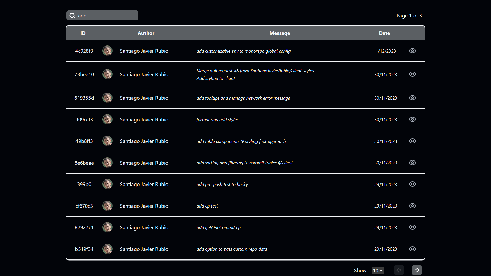

<p align="right">

</p>

# Git commit history
### Fullstack webapp to show commit history of a single repo. Built with NestJS and React

Take-Home test made for Fulltimeforce selection process

## Instructions
Start by cloning this repo
```
git clone https://github.com/SantiagoJavierRubio/git-commit-history.git
```
Then access new repo folder
```
cd git-commit-history
```
After that create a .env from [example](.env.example) file
```
copy .env.example .env
```

### Fill out your new .env fields
> *CLIENT_PORT* --> localhost port to run client app 
> 
> **SERVER_PORT** --> localhost port to run nest app -> **required**
> 
> **GITHUB_TOKEN** --> your own github token [(More info)](https://docs.github.com/en/authentication/keeping-your-account-and-data-secure/managing-your-personal-access-tokens#creating-a-personal-access-token-classic) -> **required**
>
> *REPO_OWNER* --> leave empty to use this repository's data, else add the owner name of the repo you want to use
>
> *REPO_NAME* --> leave empty to use this repository's data, else add the repository name you want to use

Install packages
```
yarn
# or
npm install
# or
pnpm install
```

Run app
```
yarn dev
# or
npm run dev
# or
pnpm dev
```

And both client and server should be available at http://localhost: \<Your configured ports>

<p align="center">

</p>

# Techs used

* [Turborepo](https://turbo.build/repo)
* [Typescript](https://www.typescriptlang.org/)
* [Vite](https://vitejs.dev/)
* [React](https://react.dev/)
* [Nest](https://nestjs.com/)
* [Tanstack Query](https://tanstack.com/query/v4/docs/react/overview)
* [Tanstack Table](https://tanstack.com/table/v8)
* [Swagger](https://swagger.io/specification/)
* [TailwindCSS](https://tailwindcss.com/)

# External APIs

* [Github Api](https://docs.github.com/en/rest?apiVersion=2022-11-28)

